<div align="center">
  


# EasySave

### Logiciel de sauvegarde professionnel développé en C# / .NET

[](https://learn.microsoft.com/en-us/dotnet/csharp/)
[](https://learn.microsoft.com/fr-fr/dotnet/core/whats-new/dotnet-10/overview)
[](https://www.sonarsource.com/)
[](https://avaloniaui.net/)

</div>

---

## Présentation

**EasySave** est un logiciel de sauvegarde développé en C# / .NET dans le cadre du projet fil rouge **ProSoft** (CESI).

Le projet est conçu pour évoluer par versions successives (v1 → v3) en respectant les principes de :
- Qualité logicielle
- Maintenabilité
- Architecture propre

<div align="center">
  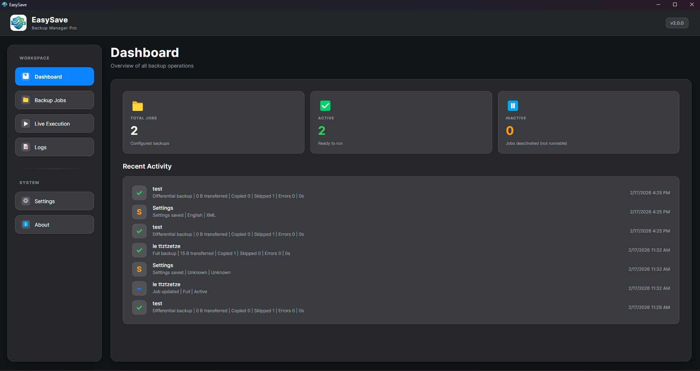
</div>

---

## Documentation

### Manuels Utilisateur


<table>
  <tr>
    <td align="center" width="50%">
      <br>
      <a href="docs/user-manual-1page.fr.md">Manuel Utilisateur</a>
    </td>
    <td align="center" width="50%">
      <br>
      <a href="docs/user-manual-1page.en.md">User Manual</a>
    </td>
  </tr>
</table>

### Support Technique

<table>
  <tr>
    <td align="center" width="50%">
      <br>
      <a href="docs/support.fr.md">Guide de Support</a>
    </td>
    <td align="center" width="50%">
      <br>
      <a href="docs/support.en.md">Support Guide</a>
    </td>
  </tr>
</table>

### Documentation Technique

<table>
  <tr>
    <td align="center" width="50%">
      <br>
      <a href="docs/architecture.fr.md">Architecture</a>
    </td>
    <td align="center" width="50%">
      <br>
      <a href="docs/architecture.en.md">Architecture</a>
    </td>
  </tr>
</table>

---

## Fonctionnalités (Version 1.0)

<table>
  <tr>
    <td><strong>Interface</strong></td>
    <td>Application console en .NET</td>
  </tr>
  <tr>
    <td><strong>Travaux de sauvegarde</strong></td>
    <td>Jusqu'à 5 travaux configurables</td>
  </tr>
  <tr>
    <td><strong>Types de sauvegarde</strong></td>
    <td>Complète & Différentielle</td>
  </tr>
  <tr>
    <td><strong>Modes d'exécution</strong></td>
    <td>Unitaire • Séquentielle • Ligne de commande (<code>1-3</code>, <code>1;3</code>)</td>
  </tr>
  <tr>
    <td><strong>Langues</strong></td>
    <td>Français & Anglais</td>
  </tr>
  <tr>
    <td><strong>Logs</strong></td>
    <td>Fichier log journalier (JSON) • Fichier d'état (<code>state.json</code>)</td>
  </tr>
  <tr>
    <td><strong>DLL dédiée</strong></td>
    <td><code>EasyLog.dll</code> pour la gestion des logs</td>
  </tr>
</table>

---

## Fonctionnalités (Version 2.0)

<table>
  <tr>
    <td><strong>Interface</strong></td>
    <td>Application graphique Avalonia</td>
  </tr>
  <tr>
    <td><strong>Travaux de sauvegarde</strong></td>
    <td>Nombre illimité de travaux configurables</td>
  </tr>
  <tr>
    <td><strong>Types de sauvegarde</strong></td>
    <td>Complète & Différentielle</td>
  </tr>
  <tr>
    <td><strong>Modes d'exécution</strong></td>
    <td>Unitaire • Séquentielle • Ligne de commande (identique à la version 1.0)</td>
  </tr>
  <tr>
    <td><strong>Langues</strong></td>
    <td>Français & Anglais, aucune chaîne en dur dans le code</td>
  </tr>
  <tr>
    <td><strong>Logs</strong></td>
    <td>
    Fichier log journalier (JSON ou XML)<br>
    • Temps de cryptage ajouté (ms)<br>
    • 0 = pas de cryptage<br>
    • &gt;0 = durée du cryptage<br>
    • &lt;0 = code erreur
    </td>
  </tr>
  <tr>
    <td><strong>Format du fichier log</strong></td>
    <td>Choix utilisateur : JSON ou XML (hérité de la version 1.1)</td>
  </tr>
  <tr>
    <td><strong>Fichier d'état</strong></td>
    <td><code>state.json</code></td>
  </tr>
  <tr>
    <td><strong>Cryptage</strong></td>
    <td>Intégration du logiciel externe <strong>CryptoSoft</strong> (cryptage conditionnel selon extensions définies)</td>
  </tr>
  <tr>
    <td><strong>Logiciel métier</strong></td>
    <td>
    Détection d’un logiciel métier<br>
    • Interdiction de lancer un travail<br>
    • En mode séquentiel : termine le fichier en cours puis stoppe<br>
    • Arrêt consigné dans le log
    </td>
  </tr>
  <tr>
    <td><strong>DLL dédiée</strong></td>
    <td><code>EasyLog.dll</code> pour la gestion des logs</td>
  </tr>
</table>

---

## Architecture

### Arborescence du projet

```
EasySave/
├── src/
│   ├── EasySave.Core           # Cœur métier, DTOs, interfaces
│   ├── EasySave.App            # Services, infrastructure, persistance
│   ├── EasySave.EasyLog        # DLL de logging
│   ├── EasySave.App.Console    # Interface console
│   ├── EasySave.App.Gui        # Interface graphique
│   └── CryptoSoft              # Chiffrement XOR
│
└── tests/
    └── EasySave.Tests          # Tests unitaires
```
---

## Équipe de Développement

<table>
  <tr>
    <td align="center">
      <strong>Christopher ASIN</strong><br>
      Développeur
    </td>
    <td align="center">
      <strong>Shayna ROSIER</strong><br>
      Développeuse
    </td>
  </tr>
  <tr>
    <td align="center">
      <strong>Mathis VOGEL</strong><br>
      Développeur
    </td>
    <td align="center">
      <strong>Maxime LANDEAU</strong><br>
      Développeur
    </td>
  </tr>
</table>

---

## Prérequis

| Composant | Version | / |
|-----------|---------|--------------|
| **Windows** | 10+ | Obligatoire |
| **.NET SDK** | 10.0+ | `dotnet --version` |
| **IDE** | Visual Studio 2026+ ou Rider | Recommandé |
| **Git** | 2.49.0 | `git --version` |

---

## Installation et Lancement

### 1. Cloner le dépôt

```bash
git clone https://github.com/RiperPro03/EasySave.git
cd EasySave
```

### 2. Générer l'executable dans 'EasySave\out\EasySave'

```bash
powershell -ExecutionPolicy Bypass -File .\scripts\publish-flat.ps1
```

### 3. Exécuter les tests unitaires

```bash
dotnet test
```

### À noter, vous pouvez lancer directement l'application Gui

```bash
dotnet run --project src/EasySave.App.Gui
```


---

## Emplacements des Fichiers

| Type de fichier | Emplacement | Description |
|----------------|-------------|-------------|
| **Logs journaliers** | `%APPDATA%\ProSoft\EasySave\Logs` | Fichiers JSON/XML avec l'historique des opérations |
| **Fichier d'état** | `%APPDATA%\ProSoft\EasySave\State\state.json` | Snapshot en temps réel de l'état global |
| **Configuration** | Dossier utilisateur système | Paramètres persistants |

---

## Licence

Ce projet est développé dans le cadre d'un projet académique **CESI**.

MIT License

Copyright &copy; 2026 — Projet académique CESI

## Diagrammes UML

### EasyLog - Système de Logging

<div align="left">

Le module **EasyLog** est une DLL dédiée au logging indépendant et réutilisable, il est de fait inchangé pour cette v2.

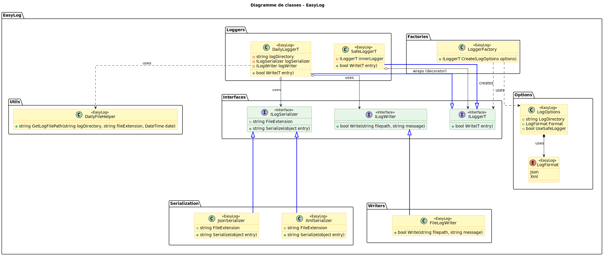

<details>
<summary><strong>Voir les détails du module EasyLog</strong></summary>

**Composants :**
- **Interfaces** : `ILogger<T>`, `ILogSerializer`, `ILogWriter`
- **Loggers** : `DailyLogger<T>`, `SafeLogger<T>`
- **Sérialisation** : JSON, XML
- **Options** : `LogOptions`, `LogFormat`
- **Factory** : `LoggerFactory`
- **Utilitaires** : `DailyFileHelper`

**Caractéristiques :**
- Écriture journalière automatique
- Support formats JSON/XML
- Option `UseSafeLogger` pour absorber les exceptions
- Horodatage et formatage des entrées

</details>

</div>

---

### Interface Utilisateur

<div align="left">

L'interface **Console** offre une expérience utilisateur en ligne de commande (CLI), elle aussi est inchangé depuis la v1, cette dernière étant "abandonné" au profit de l'interface Gui

.svg)

<details>
<summary><strong>Voir les détails du module Console</strong></summary>

**Composants :**
- **Controllers** : `MenuController`, `JobController`, `BackupController`, `SettingsController`
- **Views** : `ConsoleView`, `JobView`, `BackupView`
- **Input** : `ConsoleInput`, `ArgsParser`
- **Bootstrap** : `Program`

**Responsabilités :**
- Affichage des menus interactifs
- Gestion des commandes utilisateur
- Lancement d'un job ou d'un batch
- Internationalisation FR/EN
- Affichage des résultats en temps réel

</details>

</div>

---

L'interface **Gui** apporte l'expérience graphique d'EasySave en s'appuyant sur Avalonia et le pattern MVVM.

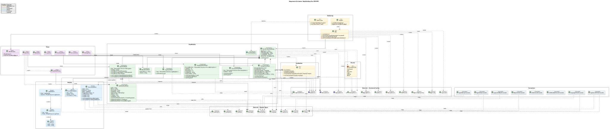

<details>
<summary><strong>Voir le résumé du module GUI</strong></summary>

**Résumé :**
- Architecture MVVM stricte : `MainWindowViewModel`, `DashboardViewModel`, `JobsViewModel`, `ExecutionViewModel`, `SettingsViewModel`.
- Vues principales : `MainWindow`, `DashboardView`, `JobsView`, `ExecutionView`, `JobEditorDialog`.
- Modèles d'affichage dédiés pour l'exécution et l'activité (`ExecutionJobItem`, `LogEntryItem`, `RecentActivityItem`).
- Navigation et actions pilotées par les ViewModels, sans logique métier dans le code-behind.
- Localisation dynamique FR/EN et convertisseurs UI (`LogLevelToBrushConverter`, `StatusToTextConverter`, `L10nFormatConverter`).
- Bootstrap de l'application via `Program`, `App` et `ViewLocator`.

</details>
</div>

---

### App - Logique Applicative

<div align="left">

Le module **App** implémente la logique applicative concrète et orchestre l'exécution des sauvegardes.

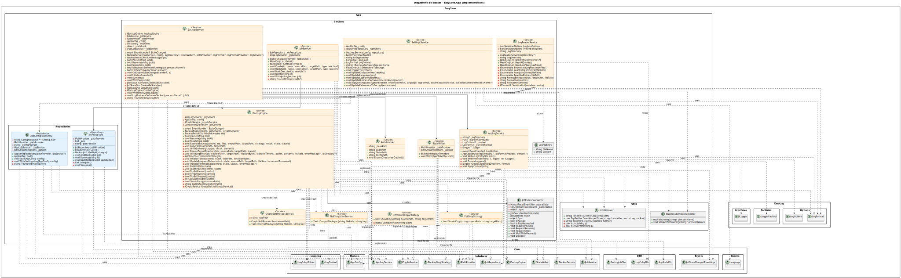

<details>
<summary><strong>Voir le résumé du module App</strong></summary>

**Résumé :**
- Orchestration des traitements via `BackupService` (pilotage) et `BackupEngine` (copie/chiffrement/état).
- Gestion métier des jobs et paramètres via `JobService` et `SettingsService`.
- Stratégies de copie `FullCopyStrategy` et `DifferentialCopyStrategy` (comparaison avancée avec hash).
- Persistance via repositories (`JobRepository`, `AppConfigRepository`) et écriture temps réel de `state.json` (`StateWriter`).
- Journalisation et diagnostic via `AppLogService`, `LogReaderService` et `PathProvider`.
- Intégration de `CryptoSoft` (`CryptoSoftProcessService`) avec fallback (`NoEncryptionService`).
- Contrôle d'exécution (Pause/Resume/Stop) et blocage si logiciel métier détecté (`BusinessSoftwareDetector`).
- Résolution des chemins réseau au format UNC pour fiabiliser l'exécution et la traçabilité (`UncResolver`).

</details>

</div>

---

### Core - Couche Métier

<div align="left">

Le module **Core** porte le domaine métier et les contrats partagés par toute l'application.

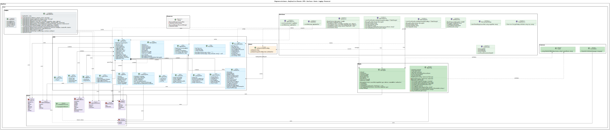

<details>
<summary><strong>Voir le résumé du module Core</strong></summary>

**Résumé :**
- Modèles métier centraux : `BackupJob`, `AppConfig`.
- DTOs d'échange et de résultat : `BackupJobDto`, `BackupResultDto`, `JobStateDto`, `LogEntryDto`, `ResultDto`, `AppStateDto`.
- Énumérations communes : `BackupType`, `JobStatus`, `Language`, `LogLevel`, `LogEventCategory`.
- Contrats d'abstraction : `IBackupEngine`, `IBackupService`, `IJobService`, `IJobRepository`, `ICryptoService`, `IAppLogService`, `IPathProvider`, `IStateWriter`.
- Événements de suivi : `JobStateChangedEventArgs`.
- Utilitaires transverses : `Guard`, `Localization`, `LogEntryBuilder`.
- Contrainte d'architecture : couche pure, indépendante de l'UI et du stockage, testable par injection d'interfaces.

</details>

</div>

---

## Diagrammes Généraux

### Diagramme d'Activité

<div align="left">

Vue d'ensemble du flux d'exécution des sauvegardes dans l'application.


<details>
<summary><strong> Flux d'activité & Processus d'exécution</strong></summary>

Étapes principales :

Initialisation : Chargement de la configuration, application de la langue et injection des services au démarrage.

Gestion des travaux : CRUD complet des jobs de sauvegarde avec persistance immédiate.

Cycle d'exécution :

Vérification préventive du logiciel métier (blocage si le processus est détecté).

Sélection intelligente de la stratégie (Complet vs Différentiel via Hash).

File d'attente séquentielle pour les lancements groupés.

Moteur de copie & Sécurité :

Boucle de copie de fichiers avec mise à jour en temps réel de l'état (Progression, Débit).

Interfaçage avec CryptoSoft pour le chiffrement à la volée selon les extensions définies.

Finalisation : Génération automatique des rapports de fin (Success/Error) et mise à jour des logs.

Contraintes de flux :

Interruption immédiate ou mise en pause si le logiciel métier est lancé en cours de backup.

Gestion des erreurs bloquantes (source indisponible) vs erreurs mineures (échec de chiffrement sur un fichier).

Pilotage interactif : Pause, Reprise ou Stop à tout moment depuis l'interface.

</details>

</div>

**Version alternative :**

<div align="center">


</div>

---

### Diagramme de Cas d'Utilisation

<div align="left">

Ce diagramme formalise les interactions entre l'utilisateur, les services externes et les fonctionnalités métier d'EasySave v2.0.

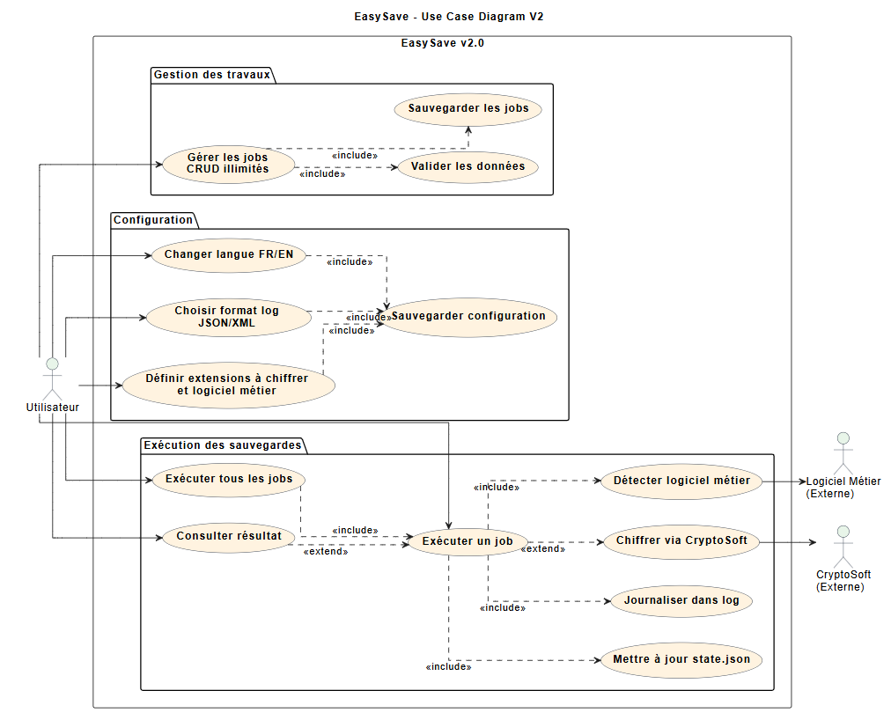

<details>
<summary><strong>Voir le résumé du scénario Use Case</strong></summary>

**Acteurs :**
- `Utilisateur` : gère les jobs (CRUD), lance un job ou tous les jobs, consulte les résultats, configure la langue et le format de log.
- `Logiciel Métier (Externe)` : est contrôlé avant/pendant l'exécution pour autoriser ou bloquer une sauvegarde.
- `CryptoSoft (Externe)` : chiffre les fichiers éligibles selon la configuration.

**Cas d'usage couverts :**
- Gestion des travaux : création/édition/suppression des jobs, validation des données, persistance.
- Exécution : lancement unitaire ou global, mise à jour de `state.json`, journalisation des événements.
- Configuration : langue FR/EN, format JSON/XML, extensions à chiffrer et logiciel métier à surveiller.

**Relations UML clés :**
- `<<include>>` : `Exécuter tous les jobs` inclut `Exécuter un job`; les actions de configuration incluent `Sauvegarder configuration`.
- `<<include>>` : `Exécuter un job` inclut la mise à jour d'état, la journalisation et la détection du logiciel métier.
- `<<extend>>` : le chiffrement via `CryptoSoft` étend l'exécution d'un job lorsqu'il est requis; la consultation de résultat étend l'exécution d'un job.

</details>

</div>

---

## Diagrammes de Séquence

### Lancement d'un Job de Sauvegarde

<div align="left">

Ce diagramme illustre le cycle complet d'un job, de la sélection par l'utilisateur jusqu'au résultat final affiché.

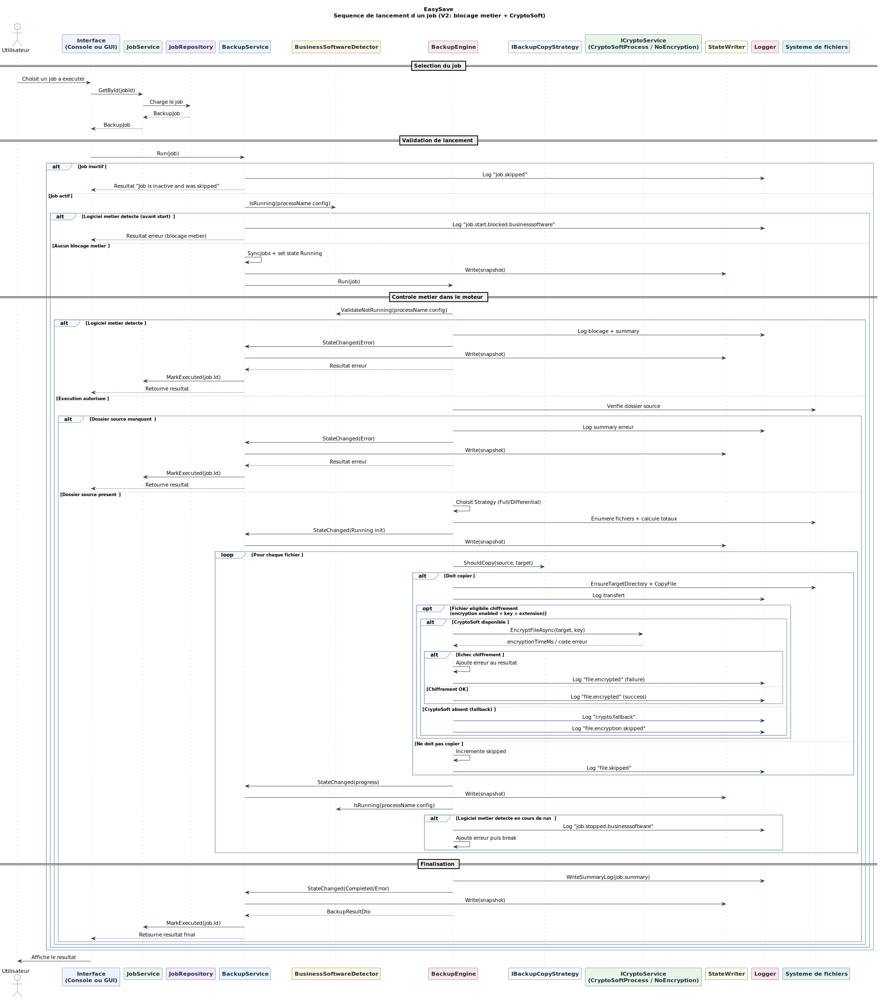

<details>
<summary><strong>Voir le résumé du scénario</strong></summary>

**Résumé :**
- Chargement du job (via `JobService`/`JobRepository`) puis validation de son état.
- Contrôle du logiciel métier avant démarrage (blocage si processus interdit détecté).
- Exécution par `BackupEngine` avec stratégie adaptée (`Full` ou `Differential`).
- Suivi temps réel: progression, écriture de l'état (`StateWriter`) et journalisation continue.
- Chiffrement conditionnel via `CryptoSoft` selon la configuration et les extensions ciblées.
- Finalisation avec log de synthèse, statut final (`Completed`/`Error`) et marquage du job exécuté.

</details>

</div>

---

### Sauvegarde Différentielle

<div align="left">

Ce diagramme décrit la logique de copie sélective en mode différentiel.

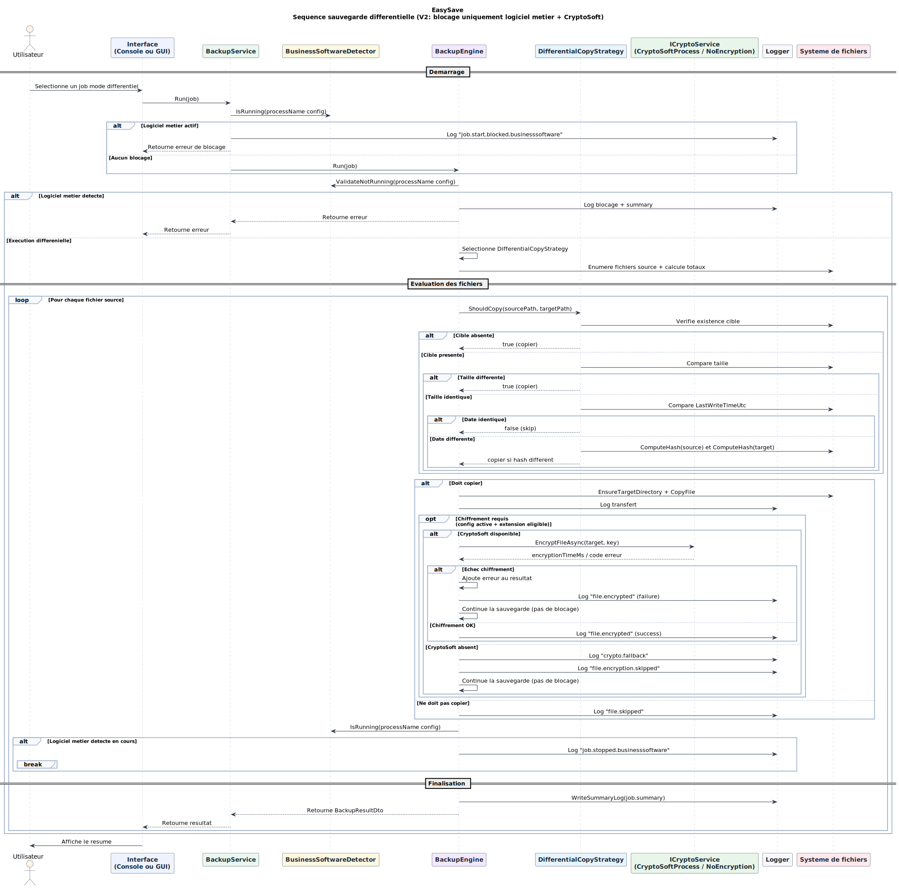

<details>
<summary><strong>Voir le résumé du scénario</strong></summary>

**Résumé :**
- Double contrôle logiciel métier: avant lancement et pendant l'exécution.
- Décision de copie par `DifferentialCopyStrategy` (existence, taille, date, puis hash si nécessaire).
- Copie uniquement des fichiers nouveaux/modifiés; les autres sont explicitement ignorés (`file.skipped`).
- Chiffrement optionnel post-copie; en cas d'échec de chiffrement, la sauvegarde continue avec erreur tracée.
- Production d'un résumé final de traitement pour le job différentiel.

</details>

</div>

---

### Lancement d'un Batch via Arguments

<div align="left">

Ce diagramme montre l'exécution séquentielle de plusieurs jobs depuis la ligne de commande.

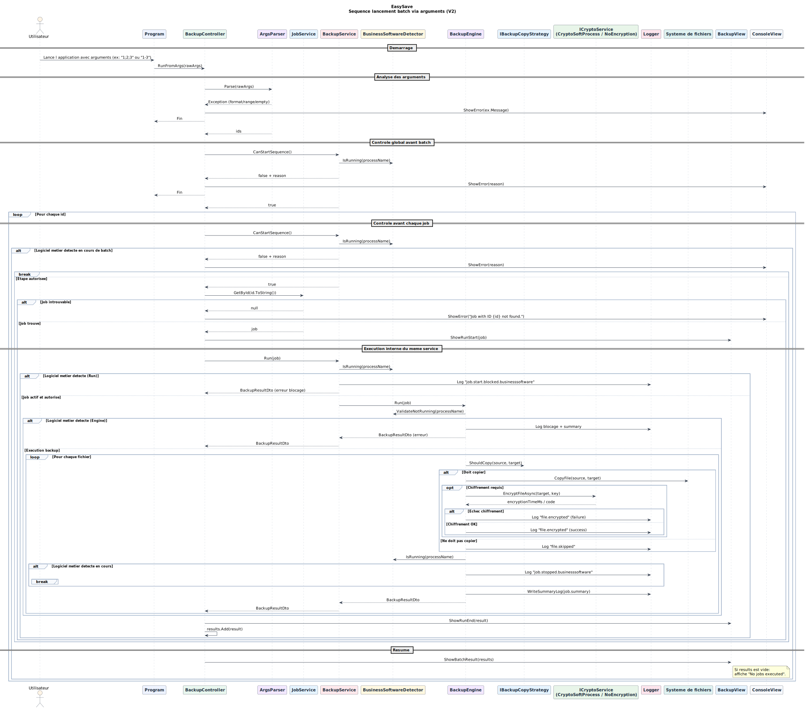

<details>
<summary><strong>Voir le résumé du scénario</strong></summary>

**Résumé :**
- Analyse des arguments (`ArgsParser`) avec support des formats `1;2;3` et `1-3`.
- Gestion immédiate des erreurs de syntaxe/intervalle avant toute exécution.
- Contrôle global puis contrôle par job (`CanStartSequence`) pour respecter la contrainte logiciel métier.
- Boucle d'exécution séquentielle: chargement du job, lancement, retour de résultat, puis passage au suivant.
- Isolation des erreurs par job et restitution d'un bilan global de batch en fin de traitement.

</details>

</div>

---

### Processus de Journalisation

<div align="left">

Ce diagramme présente la chaîne de journalisation, de la construction de l'entrée jusqu'à l'écriture disque.

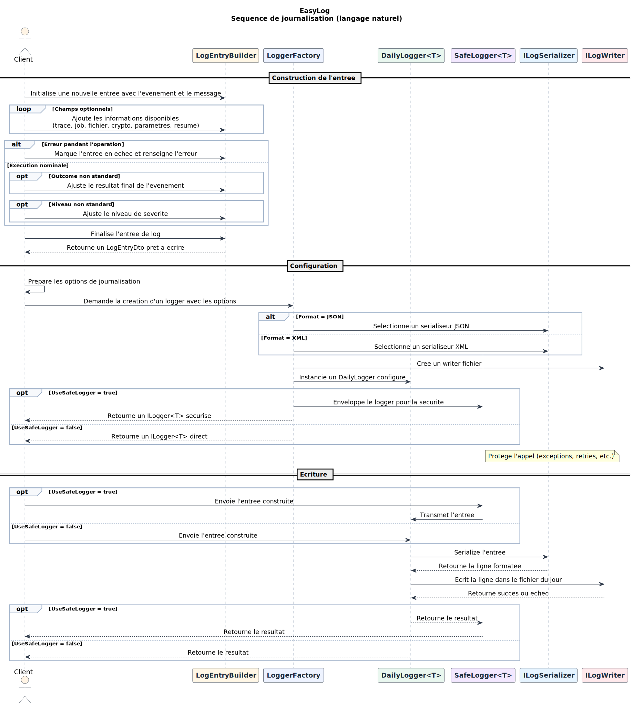

<details>
<summary><strong>Voir le résumé du scénario</strong></summary>

**Résumé :**
- Construction d'un `LogEntryDto` via `LogEntryBuilder` (contexte, résultat, niveau de sévérité).
- Création du logger via `LoggerFactory` avec sélection du format (JSON/XML).
- Instanciation de `DailyLogger` et encapsulation optionnelle par `SafeLogger` pour sécuriser l'écriture.
- Sérialisation de l'entrée puis écriture dans le fichier journalier via `ILogWriter`.
- Retour d'état (succès/échec) au client appelant pour assurer la traçabilité des opérations.

</details>

</div>

