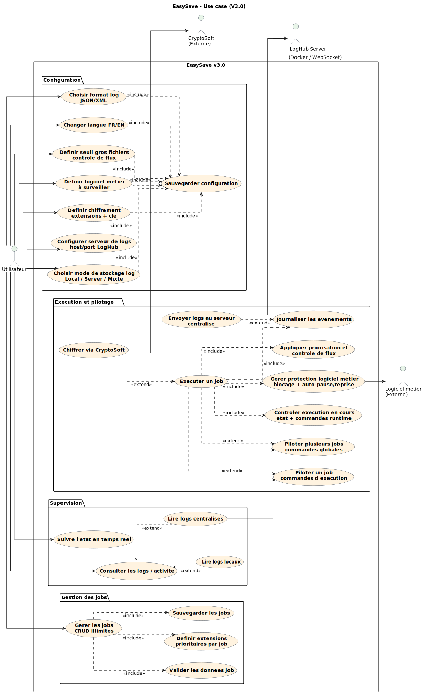
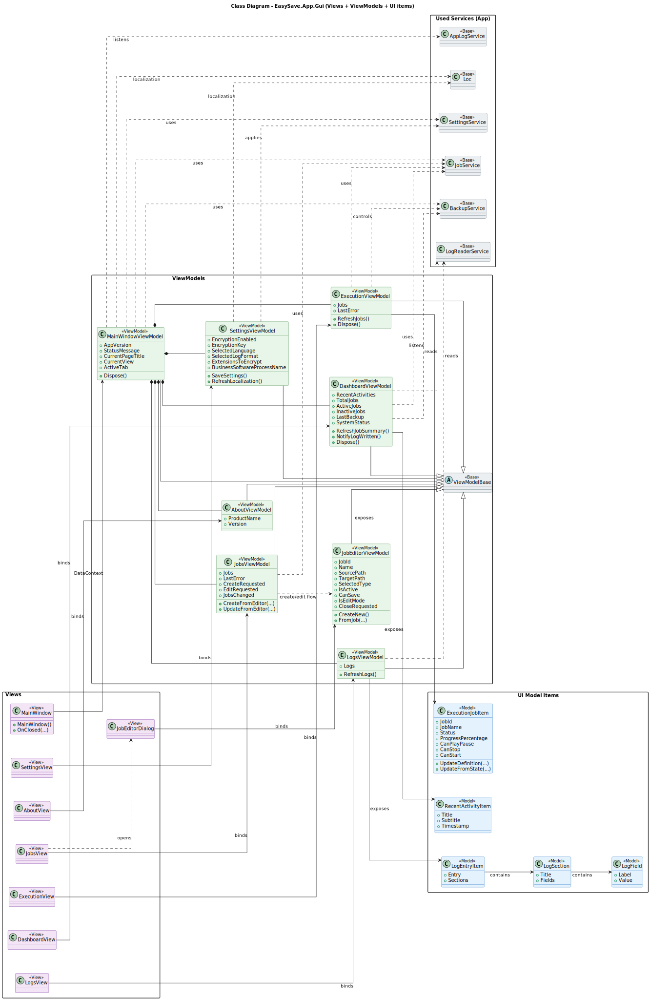
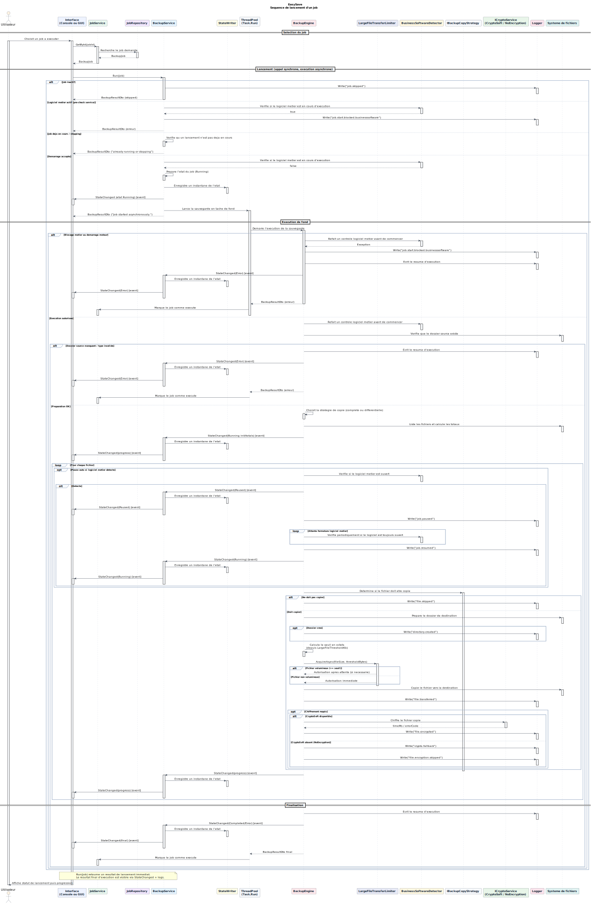
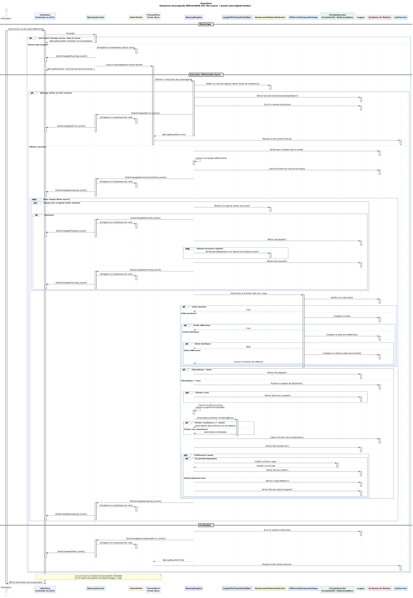
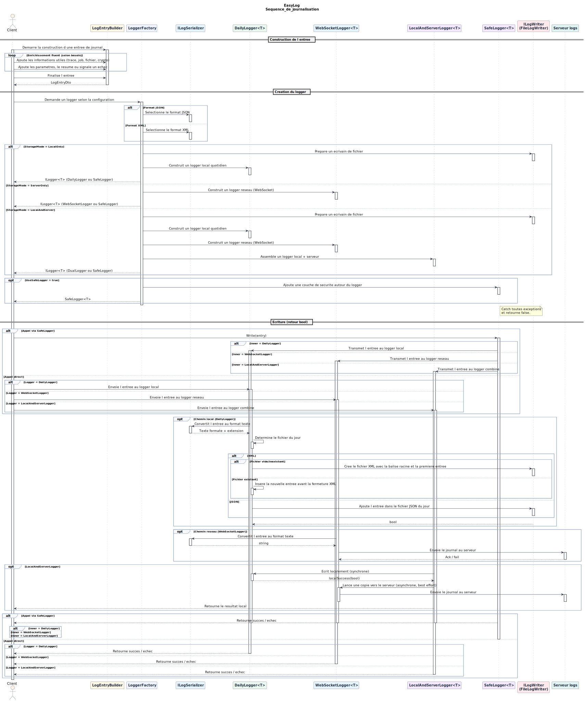

<div align="center">
  


# EasySave

### Logiciel de sauvegarde professionnel développé en C# / .NET

[](https://learn.microsoft.com/en-us/dotnet/csharp/)
[](https://learn.microsoft.com/fr-fr/dotnet/core/whats-new/dotnet-10/overview)
[](https://www.sonarsource.com/)
[](https://avaloniaui.net/)

</div>

---

## Présentation

**EasySave** est un logiciel de sauvegarde développé en C# / .NET dans le cadre du projet fil rouge **ProSoft** (CESI).

Le projet est conçu pour évoluer par versions successives (v1 → v3) en respectant les principes de :
- Qualité logicielle
- Maintenabilité
- Architecture propre

<div align="center">
  
</div>

---

## Documentation

### Manuels Utilisateur


<table>
  <tr>
    <td align="center" width="50%">
      <br>
      <a href="docs/user-manual-1page.fr.md">Manuel Utilisateur</a>
    </td>
    <td align="center" width="50%">
      <br>
      <a href="docs/user-manual-1page.en.md">User Manual</a>
    </td>
  </tr>
</table>

### Support Technique

<table>
  <tr>
    <td align="center" width="50%">
      <br>
      <a href="docs/support.fr.md">Guide de Support</a>
    </td>
    <td align="center" width="50%">
      <br>
      <a href="docs/support.en.md">Support Guide</a>
    </td>
  </tr>
</table>

### Documentation Technique

<table>
  <tr>
    <td align="center" width="50%">
      <br>
      <a href="docs/architecture.fr.md">Architecture</a>
    </td>
    <td align="center" width="50%">
      <br>
      <a href="docs/architecture.en.md">Architecture</a>
    </td>
  </tr>
</table>

---

## Fonctionnalités (Version 1.0)

<table>
  <tr>
    <td><strong>Interface</strong></td>
    <td>Application console en .NET</td>
  </tr>
  <tr>
    <td><strong>Travaux de sauvegarde</strong></td>
    <td>Jusqu'à 5 travaux configurables</td>
  </tr>
  <tr>
    <td><strong>Types de sauvegarde</strong></td>
    <td>Complète & Différentielle</td>
  </tr>
  <tr>
    <td><strong>Modes d'exécution</strong></td>
    <td>Unitaire • Séquentielle • Ligne de commande (<code>1-3</code>, <code>1;3</code>)</td>
  </tr>
  <tr>
    <td><strong>Langues</strong></td>
    <td>Français & Anglais</td>
  </tr>
  <tr>
    <td><strong>Logs</strong></td>
    <td>Fichier log journalier (JSON) • Fichier d'état (<code>state.json</code>)</td>
  </tr>
  <tr>
    <td><strong>DLL dédiée</strong></td>
    <td><code>EasyLog.dll</code> pour la gestion des logs</td>
  </tr>
</table>

---

## Fonctionnalités (Version 2.0)

<table>
  <tr>
    <td><strong>Interface</strong></td>
    <td>Application graphique Avalonia</td>
  </tr>
  <tr>
    <td><strong>Travaux de sauvegarde</strong></td>
    <td>Nombre illimité de travaux configurables</td>
  </tr>
  <tr>
    <td><strong>Types de sauvegarde</strong></td>
    <td>Complète & Différentielle</td>
  </tr>
  <tr>
    <td><strong>Modes d'exécution</strong></td>
    <td>Unitaire • Séquentielle • Ligne de commande (identique à la version 1.0)</td>
  </tr>
  <tr>
    <td><strong>Langues</strong></td>
    <td>Français & Anglais, aucune chaîne en dur dans le code</td>
  </tr>
  <tr>
    <td><strong>Logs</strong></td>
    <td>
    Fichier log journalier (JSON ou XML)<br>
    • Temps de cryptage ajouté (ms)<br>
    • 0 = pas de cryptage<br>
    • &gt;0 = durée du cryptage<br>
    • &lt;0 = code erreur
    </td>
  </tr>
  <tr>
    <td><strong>Format du fichier log</strong></td>
    <td>Choix utilisateur : JSON ou XML (hérité de la version 1.1)</td>
  </tr>
  <tr>
    <td><strong>Fichier d'état</strong></td>
    <td><code>state.json</code></td>
  </tr>
  <tr>
    <td><strong>Cryptage</strong></td>
    <td>Intégration du logiciel externe <strong>CryptoSoft</strong> (cryptage conditionnel selon extensions définies)</td>
  </tr>
  <tr>
    <td><strong>Logiciel métier</strong></td>
    <td>
    Détection d’un logiciel métier<br>
    • Interdiction de lancer un travail<br>
    • En mode séquentiel : termine le fichier en cours puis stoppe<br>
    • Arrêt consigné dans le log
    </td>
  </tr>
  <tr>
    <td><strong>DLL dédiée</strong></td>
    <td><code>EasyLog.dll</code> pour la gestion des logs</td>
  </tr>
</table>

---

## Fonctionnalités (Version 3.0 / V3)

<table>
  <tr>
    <td><strong>Interface</strong></td>
    <td>Application graphique Avalonia</td>
  </tr>
  
  <tr>
    <td><strong>Multi-langues</strong></td>
    <td>Français & Anglais (aucune chaîne en dur)</td>
  </tr>
  
  <tr>
    <td><strong>Travaux de sauvegarde</strong></td>
    <td>Nombre illimité de travaux configurables</td>
  </tr>
  
  <tr>
    <td><strong>Type de fonctionnement Sauvegarde</strong></td>
    <td>Exécution asynchrone et parallèle (mode séquentiel supprimé) avec retour immédiat de lancement puis suivi temps réel via <code>StateChanged</code></td>
  </tr>
  
  <tr>
    <td><strong>Types de sauvegarde</strong></td>
    <td>Complète & Différentielle</td>
  </tr>
  
  <tr>
    <td><strong>Gestion des fichiers prioritaires</strong></td>
    <td>Aucun fichier non prioritaire transféré tant qu’un fichier prioritaire est en attente</td>
  </tr>
  
  <tr>
    <td><strong>Interdiction de sauvegardes simultanées pour fichiers volumineux</strong></td>
    <td>Impossibilité de transférer simultanément deux fichiers &gt; n Ko (paramétrable)</td>
  </tr>
  
  <tr>
    <td><strong>Interaction temps réel</strong></td>
    <td>
    Pause / Play / Stop sur chaque travail ou tous les travaux (GUI)<br>
    • Pause effective après le fichier en cours<br>
    • Reprise immédiate<br>
    • Stop immédiat<br>
    • Suivi en temps réel (progression %, statut, activité)
    </td>
  </tr>
  
  <tr>
    <td><strong>Pause automatique (logiciel métier)</strong></td>
    <td>Pause automatique des travaux pendant l'exécution, puis reprise automatique lorsque le logiciel métier n'est plus détecté</td>
  </tr>
  
  <tr>
    <td><strong>Arrêt si détection logiciel métier</strong></td>
    <td>Blocage préventif au lancement + contrôle au démarrage moteur (état et logs mis à jour)</td>
  </tr>
  
  <tr>
    <td><strong>Cryptage</strong></td>
    <td>
    Intégration CryptoSoft<br>
    • CryptoSoft Mono-instance<br>
    • Gestion des conflits d’accès
    </td>
  </tr>
  
  <tr>
    <td><strong>Logs</strong></td>
    <td>
    Fichier log journalier (JSON ou XML)<br>
    • Temps de cryptage (ms) : 0 = pas de cryptage, &gt;0 = durée, &lt;0 = erreur<br>
    • Centralisation possible via service Docker / WebSocket (EasyLog v3)
    </td>
  </tr>
  
  <tr>
    <td><strong>Centralisation des logs</strong></td>
    <td>
    Service Docker temps réel<br>
    • Local uniquement<br>
    • Centralisé uniquement<br>
    • Local + Centralisé<br>
    • Envoi WebSocket temps réel (côté serveur)<br>
    • Le résultat local reste la référence de succès en mode hybride
    </td>
  </tr>
  
  <tr>
    <td><strong>Fichier d'état</strong></td>
    <td><code>state.json</code></td>
  </tr>
  
  <tr>
    <td><strong>DLL dédiée</strong></td>
    <td><code>EasyLog.dll</code> pour la gestion des logs</td>
  </tr>
  
  <tr>
    <td><strong>Ligne de commande</strong></td>
    <td>Identique à la version 1.0</td>
  </tr>
</table>

---

## Architecture

### Arborescence du projet

```
EasySave/
├── src/
│   ├── EasySave.Core           # Cœur métier, DTOs, interfaces
│   ├── EasySave.App            # Services, infrastructure, persistance
│   ├── EasySave.EasyLog        # DLL de logging
│   ├── EasySave.App.Console    # Interface console
│   ├── EasySave.App.Gui        # Interface graphique
│   ├── CryptoSoft              # Chiffrement XOR
│   └── LogHub.Server           # Service de centralisation des logs (Docker / WebSocket)
│
└── tests/
    └── EasySave.Tests          # Tests unitaires
```
---

## Équipe de Développement

<table>
  <tr>
    <td align="center">
      <strong>Christopher ASIN</strong><br>
      Développeur
    </td>
    <td align="center">
      <strong>Shayna ROSIER</strong><br>
      Développeuse
    </td>
  </tr>
  <tr>
    <td align="center">
      <strong>Mathis VOGEL</strong><br>
      Développeur
    </td>
    <td align="center">
      <strong>Maxime LANDEAU</strong><br>
      Développeur
    </td>
  </tr>
</table>

---

## Prérequis

| Composant | Version | / |
|-----------|---------|--------------|
| **Windows** | 10+ | Obligatoire |
| **.NET SDK** | 10.0+ | `dotnet --version` |
| **IDE** | Visual Studio 2026+ ou Rider | Recommandé |
| **Git** | 2.49.0 | `git --version` |

---

## Installation et Lancement

### 1. Cloner le dépôt

```bash
git clone https://github.com/RiperPro03/EasySave.git
cd EasySave
```

### 2. Générer l'executable dans 'EasySave\out\EasySave'

```bash
powershell -ExecutionPolicy Bypass -File .\scripts\publish-flat.ps1
```

### 3. Exécuter les tests unitaires

```bash
dotnet test
```

### À noter, vous pouvez lancer directement l'application Gui

```bash
dotnet run --project src/EasySave.App.Gui
```


---

## Emplacements des Fichiers

| Type de fichier | Emplacement | Description |
|----------------|-------------|-------------|
| **Logs journaliers** | `%APPDATA%\ProSoft\EasySave\Logs` | Fichiers JSON/XML avec l'historique des opérations |
| **Fichier d'état** | `%APPDATA%\ProSoft\EasySave\State\state.json` | Snapshot en temps réel de l'état global |
| **Configuration** | Dossier utilisateur système | Paramètres persistants |

---

## Licence

Ce projet est développé dans le cadre d'un projet académique **CESI**.

MIT License

Copyright &copy; 2026

## Diagrammes UML

### Diagramme de Cas d'Utilisation

<div align="left">

Ce diagramme formalise les interactions entre l'utilisateur, les services externes et les fonctionnalités métier d'EasySave V3 (pilotage temps réel, contraintes de copie et journalisation).



<details>
<summary><strong>Voir le résumé du scénario Use Case</strong></summary>

**Acteurs :**
- `Utilisateur` : gère les jobs (CRUD), lance un job ou tous les jobs, pilote l'exécution (Pause/Play/Stop), consulte les résultats et configure l'application.
- `Logiciel Métier (Externe)` : est contrôlé avant/pendant l'exécution pour bloquer un lancement ou déclencher une pause automatique.
- `CryptoSoft (Externe)` : chiffre les fichiers éligibles selon la configuration.
- `Serveur de logs (Externe)` : reçoit les journaux en temps réel si la centralisation est activée.

**Cas d'usage couverts :**
- Gestion des travaux : création/édition/suppression des jobs, validation des données, persistance.
- Exécution : lancement unitaire ou global, mise à jour de `state.json`, journalisation des événements et progression temps réel.
- Pilotage : pause / reprise / stop sur un job ou l'ensemble des jobs (GUI).
- Configuration : langue FR/EN, format JSON/XML, mode de stockage des logs (local / serveur / hybride), extensions à chiffrer et logiciel métier à surveiller.

**Relations UML clés :**
- `<<include>>` : `Exécuter tous les jobs` inclut `Exécuter un job`; les actions de configuration incluent `Sauvegarder configuration`.
- `<<include>>` : `Exécuter un job` inclut la mise à jour d'état, la journalisation et les contrôles de sécurité (logiciel métier, chiffrement conditionnel).
- `<<extend>>` : le chiffrement via `CryptoSoft` et la centralisation des logs étendent l'exécution d'un job lorsqu'ils sont activés.

</details>

</div>

---

### Diagramme de Classes Général

<div align="left">

Ce diagramme est composé de différents blocks : Encryption, State management, Backup execution, utilities, settings, Job management, App, Core et EasyLog


<details>
<summary><strong>Voir les détails techniques du système EasySave</strong></summary>

Résumé détaillé par module :

- Configuration et Infrastructure : Utilisation d'un modèle central AppConfig pour centraliser les paramètres (langue, logs, chiffrement, seuils). La cohérence des répertoires est assurée par PathProvider (via IPathProvider), tandis que AppConfigRepository gère la persistance physique. Le SettingsService expose les méthodes de modification dynamique (langue, chiffrement, etc.).

- Gestion des Travaux (Jobs) : Les travaux sont définis par la classe BackupJob (ID, chemins, type complet ou différentiel, extensions prioritaires). Le JobRepository assure le stockage et la récupération, tandis que le JobService orchestre la création, la mise à jour et la suppression des tâches.

- Exécution et Moteur : Le BackupService pilote le cycle de vie (Run/Pause/Stop) et vérifie les logiciels métier. Le BackupEngine réalise le transfert selon les stratégies FullCopyStrategy ou DifferentialCopyStrategy. Le contrôle est affiné par JobExecutionControl (gestion des attentes), PriorityMonitor (priorisation des extensions) et LargeFileTransferLimiter (seuil de fichiers volumineux).

- Suivi en Temps Réel : Capture de l'avancement via les DTOs JobStateDto et AppStateDto. Le StateWriter assure la persistance en temps réel dans le fichier state.json pour permettre un monitoring externe constant.

- Sécurité et Utilitaires : Gestion du chiffrement via CryptoSoftProcessService (implémentant ICryptoService) avec un mécanisme de repli (NoEncryptionService). Le BusinessSoftwareDetector suspend l'exécution en cas de détection d'un logiciel interdit, et UncResolver normalise les chemins réseau pour la traçabilité.

- Système de Journalisation : Couche d'abstraction AppLogService utilisant un LogEntryBuilder pour générer des logs enrichis (LogEntryDto). Le moteur technique EasyLog permet un stockage hybride (local via DailyLogger ou distant via WebSocketLogger), supporte les formats JSON/XML et propose des services de lecture via LogReaderService.

</details>

<div align="left">

Le module **App** implémente la logique applicative concrète et orchestre l'exécution des sauvegardes.

<details>
<summary><strong>Voir le résumé du module App</strong></summary>

**Résumé :**
- Orchestration des traitements via `BackupService` (pilotage) et `BackupEngine` (copie/chiffrement/état).
- Gestion métier des jobs et paramètres via `JobService` et `SettingsService`.
- Stratégies de copie `FullCopyStrategy` et `DifferentialCopyStrategy` (comparaison avancée avec hash).
- Persistance via repositories (`JobRepository`, `AppConfigRepository`) et écriture temps réel de `state.json` (`StateWriter`).
- Journalisation et diagnostic via `AppLogService`, `LogReaderService` et `PathProvider`.
- Intégration de `CryptoSoft` (`CryptoSoftProcessService`) avec fallback (`NoEncryptionService`).
- Contrôle d'exécution (Pause/Resume/Stop) et blocage si logiciel métier détecté (`BusinessSoftwareDetector`).
- Résolution des chemins réseau au format UNC pour fiabiliser l'exécution et la traçabilité (`UncResolver`).

</details>

</div>

<div align="left">

Le module **Core** porte le domaine métier et les contrats partagés par toute l'application.

<details>
<summary><strong>Voir le résumé du module Core</strong></summary>

**Résumé :**
- Modèles métier centraux : `BackupJob`, `AppConfig`.
- DTOs d'échange et de résultat : `BackupJobDto`, `BackupResultDto`, `JobStateDto`, `LogEntryDto`, `ResultDto`, `AppStateDto`.
- Énumérations communes : `BackupType`, `JobStatus`, `Language`, `LogLevel`, `LogEventCategory`.
- Contrats d'abstraction : `IBackupEngine`, `IBackupService`, `IJobService`, `IJobRepository`, `ICryptoService`, `IAppLogService`, `IPathProvider`, `IStateWriter`.
- Événements de suivi : `JobStateChangedEventArgs`.
- Utilitaires transverses : `Guard`, `Localization`, `LogEntryBuilder`.
- Contrainte d'architecture : couche pure, indépendante de l'UI et du stockage, testable par injection d'interfaces.

</details>

</div>

---

### EasyLog - Système de Logging

<div align="left">

Le module **EasyLog** est une DLL dédiée au logging indépendant et réutilisable. En V3, il évolue pour supporter la centralisation temps réel (WebSocket) et le mode hybride local + serveur.

**Composants :**
- **Interfaces** : `ILogger<T>`, `ILogSerializer`, `ILogWriter`
- **Loggers** : `DailyLogger<T>`, `WebSocketLogger<T>`, `LocalAndServerLogger<T>`, `SafeLogger<T>`
- **Sérialisation** : JSON, XML
- **Options** : `LogOptions`, `LogFormat`, mode de stockage (local / serveur / hybride)
- **Factory** : `LoggerFactory`
- **Utilitaires** : `DailyFileHelper`

**Caractéristiques :**
- Écriture journalière automatique (JSON/XML)
- Mode local, serveur ou hybride (local + serveur)
- Option `UseSafeLogger` pour absorber les exceptions et retourner `false`
- Envoi WebSocket temps réel en mode serveur
- Horodatage et formatage des entrées


</div>

---

### Interface Utilisateur

<div align="left">

L'interface **Console** offre une expérience utilisateur en ligne de commande (CLI), elle aussi est inchangé depuis la v1, cette dernière étant "abandonné" au profit de l'interface Gui depuis la v2

.svg)

<details>
<summary><strong>Voir les détails du module Console</strong></summary>

**Composants :**
- **Controllers** : `MenuController`, `JobController`, `BackupController`, `SettingsController`
- **Views** : `ConsoleView`, `JobView`, `BackupView`
- **Input** : `ConsoleInput`, `ArgsParser`
- **Bootstrap** : `Program`

**Responsabilités :**
- Affichage des menus interactifs
- Gestion des commandes utilisateur
- Lancement d'un job ou d'un batch
- Internationalisation FR/EN
- Affichage des résultats en temps réel

</details>

</div>

---

L'interface **Gui** apporte l'expérience graphique d'EasySave en s'appuyant sur Avalonia et le pattern MVVM.



<details>
<summary><strong>Voir le résumé du module GUI</strong></summary>

**Résumé :**
- Architecture MVVM stricte : `MainWindowViewModel`, `DashboardViewModel`, `JobsViewModel`, `ExecutionViewModel`, `SettingsViewModel`.
- Vues principales : `MainWindow`, `DashboardView`, `JobsView`, `ExecutionView`, `JobEditorDialog`.
- Modèles d'affichage dédiés pour l'exécution et l'activité (`ExecutionJobItem`, `LogEntryItem`, `RecentActivityItem`).
- Navigation et actions pilotées par les ViewModels, sans logique métier dans le code-behind.
- Localisation dynamique FR/EN et convertisseurs UI (`LogLevelToBrushConverter`, `StatusToTextConverter`, `L10nFormatConverter`).
- Bootstrap de l'application via `Program`, `App` et `ViewLocator`.

</details>
</div>

---

### Diagramme d'Activité

<div align="left">

Vue d'ensemble du flux d'exécution des sauvegardes dans l'application.


<details>
<summary><strong> Flux d'activité & Processus d'exécution</strong></summary>

Étapes principales :
- Initialisation : Chargement de la configuration, application de la langue et injection des services au démarrage.
- Gestion des travaux : CRUD complet des jobs de sauvegarde avec persistance immédiate.

Cycle d'exécution :
- Vérification préventive du logiciel métier (blocage si le processus est détecté).
- Lancement asynchrone des jobs avec retour immédiat à l'UI puis exécution en tâche de fond.
- Sélection intelligente de la stratégie (Complet vs Différentiel via hash si nécessaire).
- Coordination des contraintes V3 : fichiers prioritaires, limitation des gros fichiers, pause/reprise/stop.

Moteur de copie & Sécurité :
- Boucle de copie de fichiers avec mise à jour en temps réel de l'état (`StateWriter`) et notifications `StateChanged`.
- Pause automatique si logiciel métier détecté en cours d'exécution, puis reprise automatique.
- Interfaçage avec CryptoSoft pour le chiffrement à la volée selon les extensions définies et gestion des conflits d'accès.

Finalisation : Génération automatique du résumé d'exécution (Success/Error), mise à jour des logs et marquage du job exécuté.

Contraintes de flux :
- Blocage préventif au lancement et contrôle au démarrage moteur si le logiciel métier est détecté.
- Gestion des erreurs bloquantes (source indisponible) vs erreurs mineures (échec de chiffrement sur un fichier).
- Pilotage interactif : Pause, Reprise ou Stop à tout moment depuis l'interface.

</details>

---

## Diagrammes de Séquence

### Lancement d'un Job de Sauvegarde

<div align="left">

Ce diagramme illustre le cycle complet V3 d'un job : sélection, lancement synchrone avec retour immédiat, puis exécution asynchrone et suivi temps réel.



<details>
<summary><strong>Voir le résumé du scénario</strong></summary>

**Résumé :**
- Chargement du job (`JobService` / `JobRepository`) puis appel `Run(job)` sur `BackupService`.
- `Run(job)` retourne un résultat de lancement immédiat ; la fin réelle est publiée via `StateChanged` et les logs.
- Double contrôle du logiciel métier (pré-check service puis contrôle au démarrage moteur).
- Exécution par `BackupEngine` avec stratégie adaptée (`Full` ou `Differential`), limitation des gros fichiers (`LargeFileTransferLimiter`) et chiffrement conditionnel via `CryptoSoft`.
- Suivi temps réel : progression, écriture de l'état (`StateWriter`) et journalisation continue (`Logger`).
- Finalisation en tâche de fond avec statut final (`Completed`/`Error`) et marquage du job exécuté par `JobService`.

</details>

</div>

---

### Sauvegarde Différentielle

<div align="left">

Ce diagramme décrit la sauvegarde différentielle V3 en tâche de fond, avec pause automatique si logiciel métier détecté et gestion des contraintes de transfert.



<details>
<summary><strong>Voir le résumé du scénario</strong></summary>

**Résumé :**
- `BackupService` démarre l'exécution en arrière-plan (`Task.Run`) et renvoie immédiatement un accusé de lancement.
- `BackupEngine` refait un contrôle logiciel métier au démarrage puis publie les états via `StateChanged`.
- En mode différentiel, `DifferentialCopyStrategy` décide la copie (existence, taille, date, hash si nécessaire).
- Les fichiers non modifiés sont journalisés (`file.skipped`) ; les fichiers à copier passent par la préparation du dossier, la limitation des gros fichiers et la copie.
- Le chiffrement est optionnel après copie (`CryptoSoft` / fallback `NoEncryptionService`).
- En cours d'exécution, une détection du logiciel métier provoque une pause automatique, puis une reprise automatique après fermeture.
- Finalisation : résumé d'exécution, état final et marquage du job exécuté.

</details>

</div>

---

### Processus de Journalisation

<div align="left">

Ce diagramme présente la chaîne de journalisation EasyLog V3 : construction de l'entrée, création du logger et écriture locale, serveur ou hybride.



<details>
<summary><strong>Voir le résumé du scénario</strong></summary>

**Résumé :**
- Construction d'un `LogEntryDto` via `LogEntryBuilder` (contexte, résultat, niveau de sévérité).
- Création du logger via `LoggerFactory` avec sélection du format (JSON/XML) et du mode de stockage (local, serveur, hybride).
- Instanciation de `DailyLogger`, `WebSocketLogger` ou `LocalAndServerLogger`, avec encapsulation optionnelle par `SafeLogger`.
- Chemin local : sérialisation puis écriture dans le fichier journalier via `ILogWriter`.
- Chemin serveur : sérialisation puis envoi au serveur de logs via WebSocket.
- Chemin hybride : succès local prioritaire et envoi serveur.

</details>

</div>

